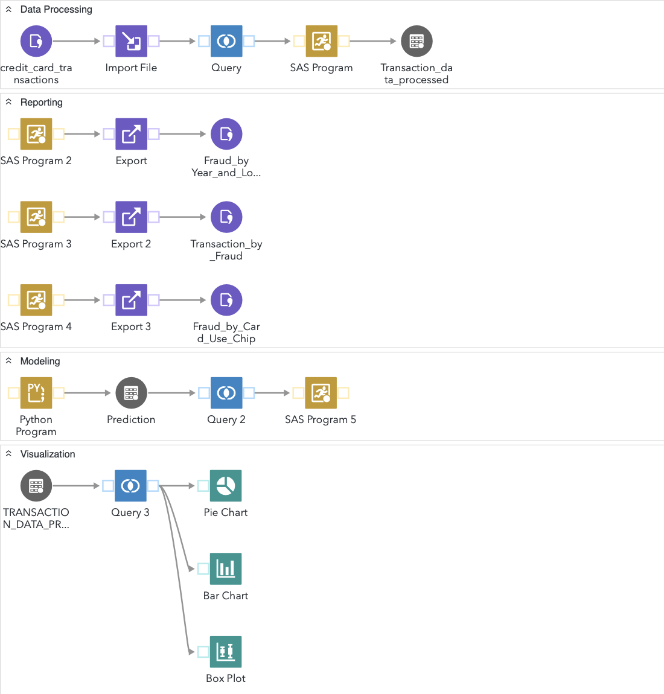

# Fraud Detection ETL Pipeline in SAS

## Overview
Welcome to the Fraud Detection ETL Pipeline project! This project demonstrates the development of an **ETL pipeline integrated with SAS** to process **credit card transactions**, apply **machine learning for fraud detection**, and generate **reporting insights** to drive business decisions. The pipeline is structured to be adaptable for various data-driven applications, including marketing and finance.

## Workflow Stages 
The workflow consists of five key stages:
1. **Data Extraction**: Downloading transaction data from Kaggle and storing it in a GitHub repository.
2. **Data Processing**: Cleaning and transforming the data using **SQL and SAS**.
3. **Reporting**: Generating dimensional tables to summarize transaction patterns.
4. **Modeling**: Building a **fraud detection model** using **Python (Random Forest Classifier)**.
5. **Visualization**: Creating **SAS-based dashboards and reports** to identify fraud trends.

## [Dataset](https://www.kaggle.com/datasets/ealtman2019/credit-card-transactions/data?select=sd254_users.csv)
- The dataset is sourced from **IBM's financial database** via Kaggle.
- It consists of **24 million credit card transaction records**.
- For demonstration, a **subset of 1,164 rows and 15 variables** is used.
- The dataset includes key features such as **card details, transaction time, amount, and location**.

## Implementation Details
### 1. Data Processing
- Importing **CSV files** and filtering transactions based on a three-year timeframe.
- Handling missing values and **categorizing locations** into 'US' and 'Other'.
- Exporting processed data into a **SAS library** for further analysis.

### 2. Reporting Automation
- Using **SAS programs** to generate **dimensional tables** for summarizing transaction behaviors.
- Key insights derived include:
  - Fraud counts were **lowest in 2016** compared to other years.
  - **Fraudulent transactions tend to have lower average amounts** than non-fraudulent ones in the US.

### 3. Fraud Detection Model
- Data **preprocessing in Python** (encoding, defining predictors, train-test split).
- Building a **Random Forest Classifier** to predict fraudulent transactions.
- Exporting results to **SAS for performance evaluation**.
- Calculating **accuracy metrics** and generating a model performance report.

### 4. Data Visualization
- Creating **charts in SAS** to visualize transaction records across different dimensions.
- **Bar Chart**: Shows seasonal trends with **fraud cases spiking in October and December**.
- **Box Plot**: Helps detect outliers and high-risk transactions by analyzing transaction amounts.

## Future Improvements
To enhance the pipeline, the following improvements are suggested:
- **Automating data ingestion and validation**.
- **Optimizing model deployment** for better fraud detection efficiency.
- **Enhancing visualization capabilities** for deeper insights.

## Repository Structure
```plaintext
📂 fraud-detection-etl
│── 📂 data                 # Raw & processed datasets
│── 📂 scripts              # Python & SAS scripts for ETL & modeling
│── 📂 reports              # Generated reports and visualizations
│── README.md               # Project documentation
│── requirements.txt        # Dependencies (if applicable)
